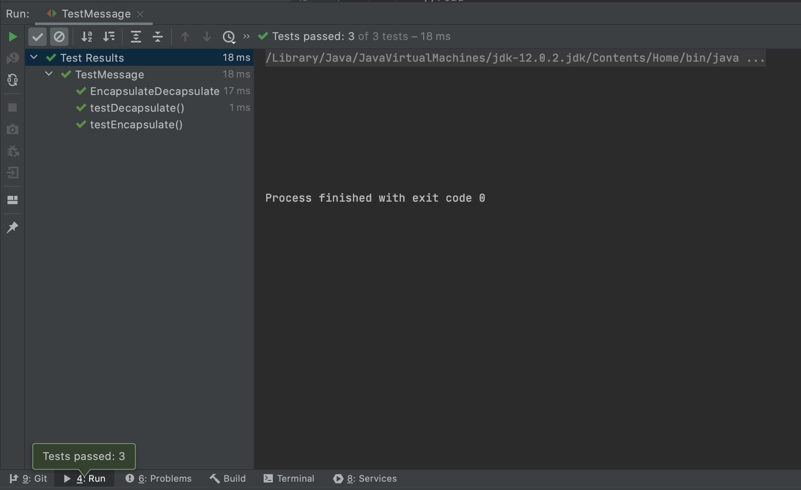
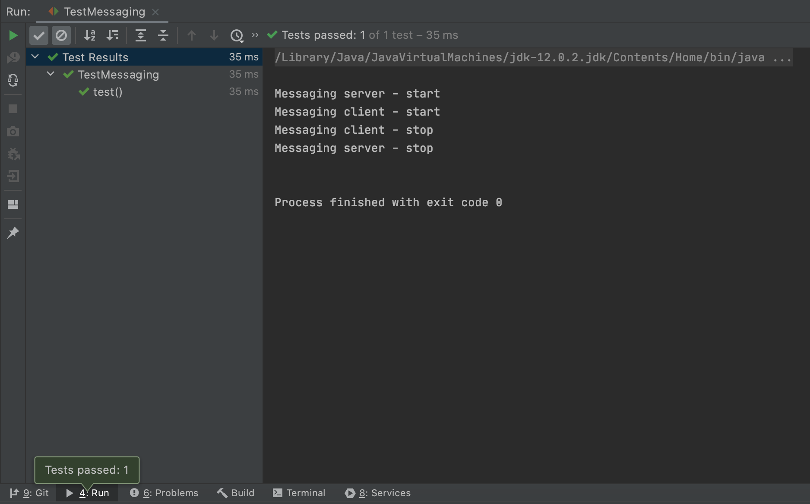
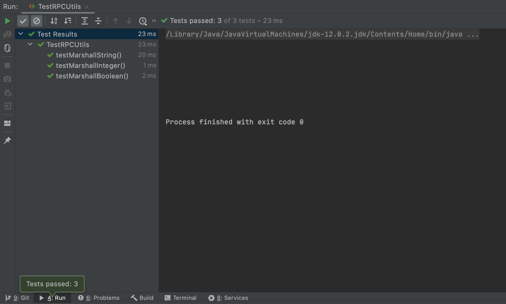
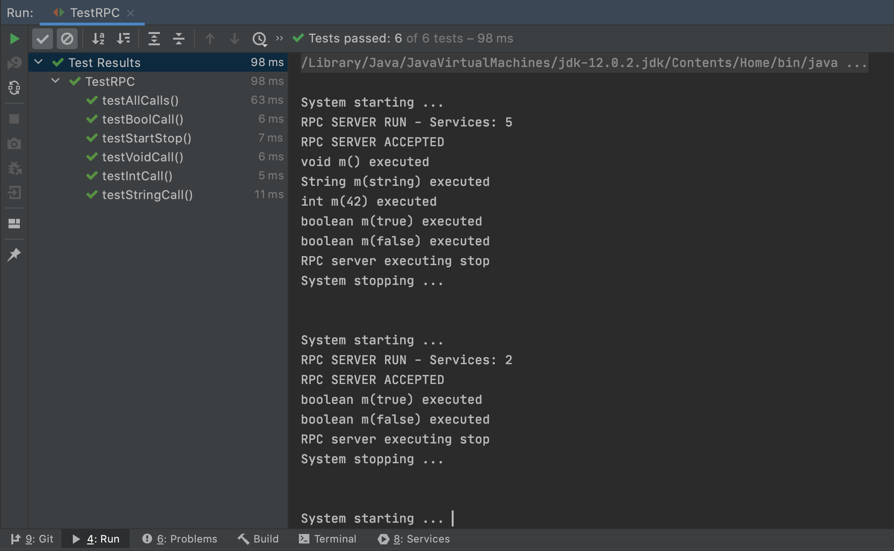
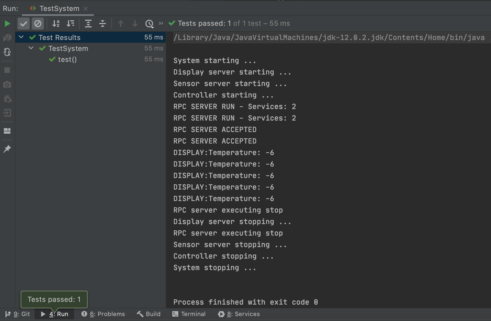

## DAT110 - Project 1: Socket Programming and RPC middleware

### Organisation

Group members:
  Olav Pete - 488249
  Aahed Diyab - 588408

### Overview

Github link: https://github.com/Unslinga/dat110-project1-startcode

### Tests:

TestMessage:



TestMessaging:



TestRPCUtils:



TestRPC:



TestSystem:


### Logs:

TestMessage:
```
System starting ... 
RPC SERVER RUN - Services: 5
RPC SERVER ACCEPTED
void m() executed
String m(string) executed
int m(42) executed
boolean m(true) executed
boolean m(false) executed
RPC server executing stop
System stopping ... 


System starting ... 
RPC SERVER RUN - Services: 2
RPC SERVER ACCEPTED
boolean m(true) executed
boolean m(false) executed
RPC server executing stop
System stopping ... 


System starting ... 
RPC SERVER RUN - Services: 1
RPC SERVER ACCEPTED
RPC server executing stop
System stopping ... 


System starting ... 
RPC SERVER RUN - Services: 2
RPC SERVER ACCEPTED
void m() executed
RPC server executing stop
System stopping ... 


System starting ... 
RPC SERVER RUN - Services: 2
RPC SERVER ACCEPTED
int m(42) executed
RPC server executing stop
System stopping ... 


System starting ... 
RPC SERVER RUN - Services: 2
RPC SERVER ACCEPTED
String m(string) executed
RPC server executing stop
System stopping ... 


Process finished with exit code 0
```

TestSystem:
```
System starting ...
Display server starting ...
Sensor server starting ...
Controller starting ...
RPC SERVER RUN - Services: 2
RPC SERVER RUN - Services: 2
RPC SERVER ACCEPTED
RPC SERVER ACCEPTED
DISPLAY:Temperature: -6
DISPLAY:Temperature: -6
DISPLAY:Temperature: -6
DISPLAY:Temperature: -6
DISPLAY:Temperature: -6
RPC server executing stop
Display server stopping ...
RPC server executing stop
Sensor server stopping ...
Controller stopping ...
System stopping ...


Process finished with exit code 0
```